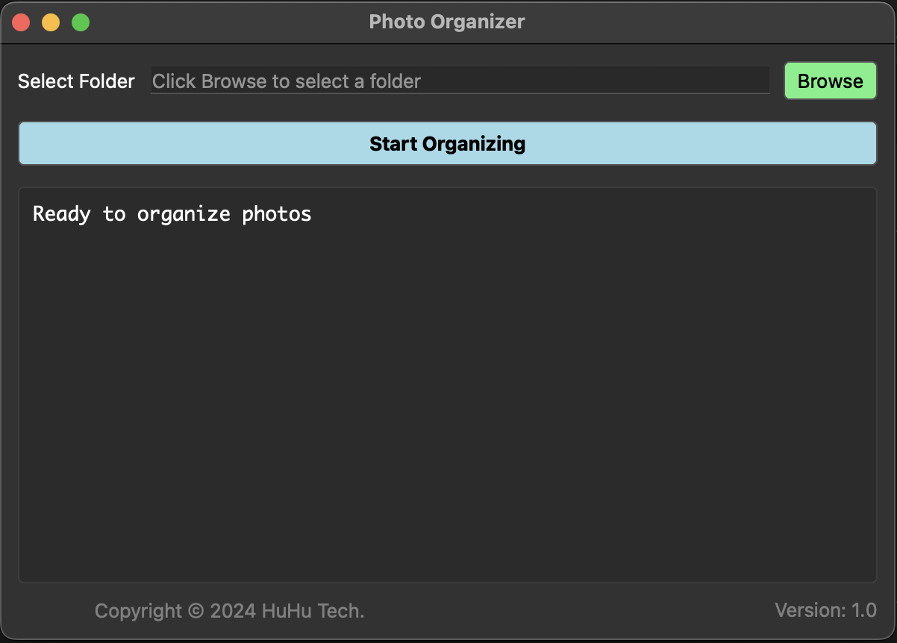

## 目的

整理照片時，發現日積月累了很多不同的分類方式，導致很難整理

個人覺得用 年_月_事件簡述 的方式最能有效率的歸檔和找尋

所以做了簡單的應用，來指定照片的folder，讓這些照片可以自動依照這個方式歸檔

建議先選擇一個相對不複雜的資料夾做測試。

熟悉運作原理再指定比較大的資料夾

注意：分好之後，是沒辦法一鍵還原的，

所以如果不確定最後結果，可以把所有的照片備份到外接硬碟中。

## 用法

選擇一個照片資料夾，按下執行，

會取得這個資料夾裡面的影像檔案的生成日期

把它們分類到 YYYY_MM_ 的資料夾

比如 IMG001.JPG 是 2025年5月13日拍攝

就會分到 2025_05_ 資料夾

這樣分好之後，你可以審視內容，加在底線之後，比如

    2025_05_東京京都大阪七日遊

方便之後查找

### 規則

    目前支援：HEIF, JPG, PNG, MOV, MP4

    沒有找到日期的檔案或者不支援的格式，會留在原地，到時候手動再分

    如果有很多重複的檔名比如不同資料夾下都有 IMG001.JPG 就會用[_時間碼]來區分，不會覆蓋

## 版本更新

    v1.0 (2024 08 29)

## 下載app

### macOS (Apple Silicon)

[Photo Organizer.dmg](https://github.com/gumpcpy/photo-organizer/releases/download/v1.0/Photo.Organizer.dmg)

### 系統需求
- macOS 11.0 或更新版本
- Apple Silicon (M1/M2/M3) 芯片

## Screenshots

### 主界面

<!--  -->

